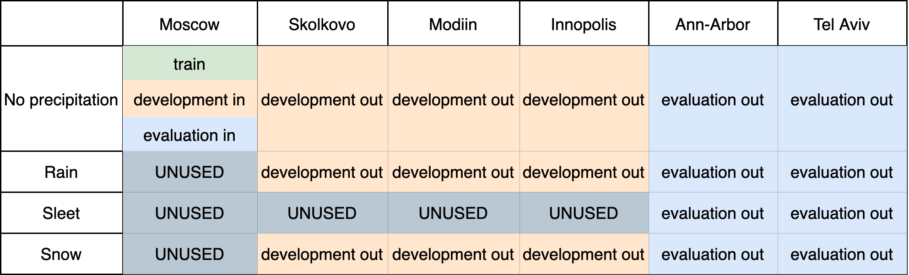

# Scene tags
The motion prediction dataset consists of a number of scenes. One scene represents a state of the environment around the self-driving vehicle at a given moment in time. Every scene includes a set of tags associated with it. Tags for one scene hold its metadata including the following:
- a time of the day (night, morning, afternoon or evening)
- a year season (winter, spring, summer, autumn)
- a track where the ride was taken (Moscow, Skolkovo, Innopolis, Ann Arbor, Modiin or Tel Aviv)
- a sun phase (astronomical night, twilight or daylight)
- weather conditions, type of the precipitation observed (no precipitation, rain, sleet or snow)

All the available scene tags can be found in [tags.proto](ysdc_dataset_api/proto/tags.proto).

# How to filter scenes by tags
For an example of filters usage refer to [data_partitioning.ipynb](examples/data_partitioning.ipynb)

# Canonical partition
The canonical dataset partition relies on location and precipitation tags to split the data.

# How get the canonical data partitioning
To get the canonical data partitioning we provide a set of scene tags filters. The filters are located in [sdc/filters.py](sdc/filters.py) file. Find the example in [data_partitioning.ipynb](examples/data_partitioning.ipynb) notebook under **Canonical Partitioning** section.
